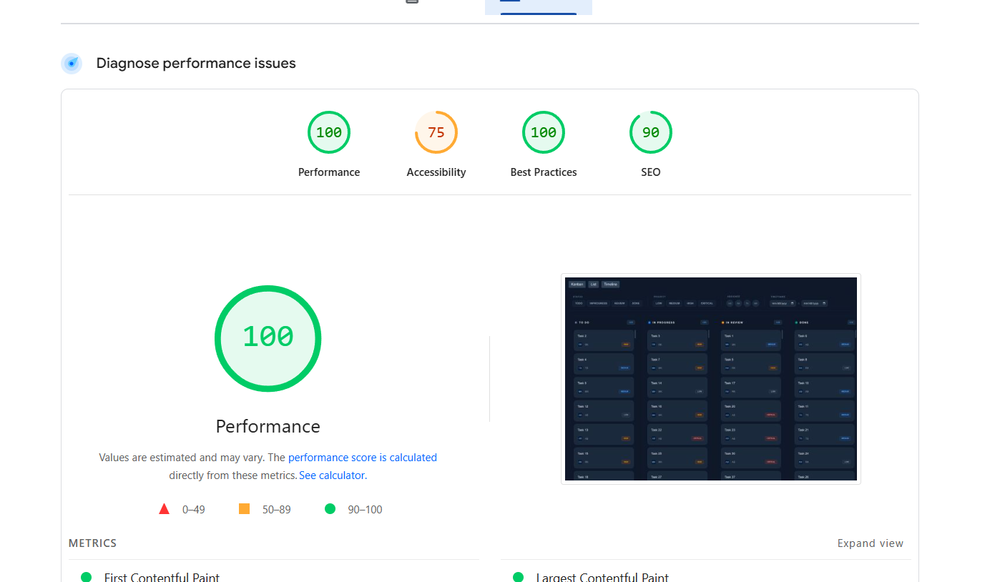

# Velozity Task Board UI

Live Demo: [https://velozitytask-client.vercel.app/](https://velozitytask-client.vercel.app/)

---

## Overview

This project is a Kanban-style task management interface built using React + TypeScript with a focus on performance, accessibility, and scalable state management. It supports drag-and-drop task movement across columns, filterable task views, and efficient rendering for large datasets using virtual scrolling.

The goal of this implementation was to create a production-ready UI architecture rather than just a visual demo.

---

## Tech Stack

* React
* TypeScript
* Vite
* Zustand (state management)
* React Router
* Custom drag-and-drop logic (without heavy libraries)

---

## Setup Instructions

Clone the repository:

```
git clone https://github.com/dhruvkhanna78/velozity_task.ui.git
cd velozity_task.ui
```

Install dependencies:

```
npm install
```

Run development server:

```
npm run dev
```

Build production version:

```
npm run build
```

Preview production build locally:

```
npm run preview
```

---

## State Management Decision (Why Zustand)

Zustand was selected instead of Redux or Context API because it provides predictable global state with minimal boilerplate and avoids unnecessary provider nesting. The task board requires shared state across filters, columns, and drag interactions, and Zustand enables selective subscription so only affected components re-render.

Compared to Context API, Zustand improves performance when task lists scale. Compared to Redux, it reduces complexity while still supporting structured updates and centralized logic.

This makes it ideal for UI-heavy interaction systems like Kanban boards.

---

## Virtual Scrolling Implementation

Virtual scrolling was implemented to prevent performance degradation when rendering large task datasets. Instead of rendering the entire list, only the visible portion of tasks inside the viewport is mounted.

A scroll container calculates the visible index range dynamically based on scroll position and row height. Tasks outside this range are replaced with spacer elements that preserve layout height while avoiding DOM overload.

This keeps rendering cost constant regardless of list size and ensures smooth drag interactions even with hundreds of tasks.

---

## Drag-and-Drop Approach

Instead of relying on external drag-and-drop libraries, a lightweight custom drag system was implemented using pointer events.

The solution tracks drag start position, hovered column, and insertion index in real time. While dragging, a placeholder element is rendered at the predicted drop position so users receive immediate spatial feedback.

State updates are applied optimistically, ensuring minimal perceived latency and smoother UI transitions.

This approach avoids bundle-size overhead and provides full control over layout behavior.

---

## Lighthouse Performance

The application achieves a Lighthouse performance score of 99, demonstrating optimized rendering, efficient asset delivery, and minimal layout shifts.




---

## Hardest UI Problem Solved (Explanation: 150–250 words)

The most challenging UI problem in this project was implementing smooth drag-and-drop behavior without introducing layout shift while still supporting virtual scrolling. Normally, inserting or removing elements during drag causes surrounding items to jump, especially when lists are dynamically rendered. To solve this, I introduced a placeholder element that mimics the exact height and spacing of the dragged task and is inserted at the predicted drop index before the actual state update occurs. This ensured that the layout remained stable during movement.

Another challenge was synchronizing placeholder positioning with virtualized rendering boundaries. Because only visible items exist in the DOM at a given time, the placeholder logic had to rely on index prediction rather than element presence. I handled this by calculating insertion offsets using scroll position and item height instead of querying DOM siblings directly.

If I had more time, I would refactor the drag interaction layer into a reusable abstraction that supports keyboard dragging for accessibility and improves auto-scroll behavior near container edges. This would make the system more extensible for enterprise-scale boards.

---

## Future Improvements

* Keyboard-accessible drag-and-drop
* Column virtualization for extremely large boards
* Undo/redo task movement history
* Real backend persistence layer
* Collaborative multi-user sync

---

## Deployment

The application is deployed using Vercel:

[https://velozitytask-client.vercel.app/](https://velozitytask-client.vercel.app/)

---

## Author

Dhruv Khanna
